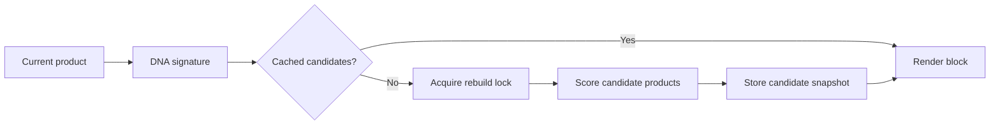

# A2 Style DNA Similar Products

## Overview

Public showcase for a WooCommerce similar-products engine based on product signatures, cached candidate scoring, and anti-stampede protection.

## Problem

Recommendation blocks on product pages were too expensive when generated from live product queries and repeated scoring. The system needed fast render times while keeping recommendations relevant.

## Technical Approach

- Build a compact product DNA signature from safe catalog attributes.
- Cache candidate IDs and scoring output.
- Refresh only when fingerprints change.
- Protect cache rebuilds with locks to avoid stampedes.
- Keep the frontend block simple and predictable.

## Key Features

- Signature-based similarity
- Candidate caching
- Anti-stampede protection
- Incremental scoring refresh
- WooCommerce shortcode/block integration boundary

## Performance / Business Impact

- Similar-products block render: 1.9s -> 0.42s

## Architecture

## Code Samples

- `samples/sample-cache-layer.php`

## Security & Privacy Notes

The sample omits production scoring weights, catalog rules, and business-specific merchandising logic.

## Tech Stack

PHP, WordPress, WooCommerce, MySQL, transients/object cache.

## Related Links

- Portfolio: https://amiraliyaghouti.com
- GitHub profile: https://github.com/shiny-a2

