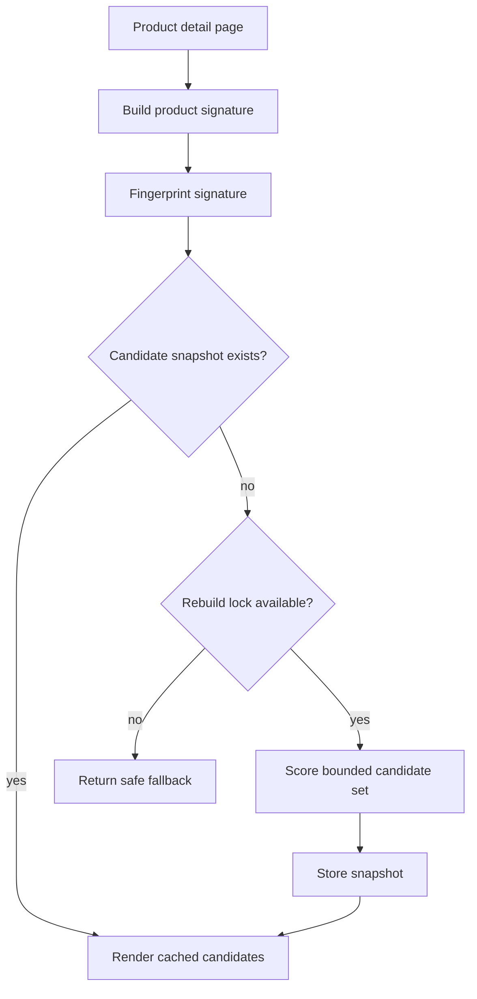

# A2 Style DNA Similar Products

Public-safe case study for a WooCommerce similar-products system based on product signatures, candidate scoring, cache snapshots, and rebuild protection.

## Reviewer Shortcut

This repo demonstrates a WooCommerce product recommendation system designed around cached candidate snapshots instead of expensive live catalog scans. It relates to PDP recommendation blocks where relevance must not slow down rendering. It proves signature-based matching, cache invalidation planning, rebuild locks, render budgets, and fallback behavior. Start with `docs/infrastructure`, `docs/engineering-notes`, and `samples/infrastructure`. This is a showcase repository, not a production package.

## Overview

Recommendation blocks are easy to add and easy to make expensive. This project represents the architecture behind a similar-products layer that avoids repeated live catalog scoring on product detail pages.

## Production Context

- Product pages needed relevant recommendations without adding heavy query cost to PDP rendering.
- Catalog attributes could be used as style signals, but production scoring rules had to remain private.
- The block had to degrade gracefully if cache rebuilds failed or candidate data was stale.

## Problem

Live recommendation queries were too expensive for render-time execution. The system needed to reuse stable product signatures and cached candidates while still refreshing when product fingerprints changed.

## Operational Constraints

- Do not expose private merchandising weights.
- Do not run full candidate scoring on every page view.
- Do not let cache rebuilds stampede under traffic.
- Return a safe fallback when recommendation data is unavailable.

## Scaling Challenges

- Product pages can receive repeated anonymous traffic.
- Similarity scoring grows with catalog size if not bounded.
- Attribute changes require cache freshness without global rebuild pressure.
- Empty or stale recommendation blocks can harm the UX if not handled deliberately.

## Architecture Decisions

- Build a compact product signature from safe catalog fields.
- Use fingerprinted cache keys so unchanged products reuse existing candidates.
- Use short-lived locks during rebuilds.
- Separate signature building, candidate scoring, cache access, and rendering.
- Keep public samples generic and omit private scoring weights.

## Recommendation Flow

## Tradeoffs

- Cached candidates improve render time but require freshness rules.
- Signature-based matching is explainable but less flexible than opaque ML ranking.
- Locking avoids stampedes but may return temporary fallback content.
- Public samples show structure, not private merchandising strategy.

## Failure Prevention

- Rebuild locks prevent concurrent scoring.
- Candidate limits prevent unbounded queries.
- Cache keys include fingerprints.
- Rendering tolerates empty results.
- Slow scoring work is kept out of the normal render path where possible.

## Performance Strategy

| Bottleneck | Strategy | Verified impact |
|---|---|---|
| Similar-products block render | signature cache + candidate snapshots + rebuild locks | 1.9s -> 0.42s |

## Operational Learnings

- Recommendation systems in WooCommerce often fail because they are treated as UI widgets instead of data pipelines.
- The best first optimization is moving scoring away from the critical render path.
- A simple explainable signature model can be easier to operate than a more complex black-box model.

## Future Improvements

- Add sanitized before/after block screenshots.
- Add a public fixture for signature scoring tests.
- Add admin diagnostics for cache age and candidate counts.

## Code Samples

- signature builder;
- scoring service;
- cache layer;
- renderer boundary.

## Engineering Notes

- [Recommendation without heavy real-time queries](docs/engineering-notes/recommendation-without-heavy-real-time-queries.md)
- [Cache invalidation for similar products](docs/engineering-notes/cache-invalidation-for-similar-products.md)

## Infrastructure Notes

- [Request lifecycle](docs/infrastructure/request-lifecycle.md)
- [Observability and instrumentation](docs/infrastructure/observability-and-instrumentation.md)
- [Failure mode matrix](docs/infrastructure/failure-mode-matrix.md)
- [Infrastructure samples](samples/infrastructure)

## Quality Signal

- [Quality signal notes](docs/quality-signal.md)
- [Sample PHP syntax workflow](.github/workflows/sample-php-lint.yml)
- [Samples directory](samples)

## Security & Privacy Notes

Production scoring weights, private catalog strategy, product identifiers, and business-specific merchandising logic are excluded.

## Tech Stack

PHP, WordPress, WooCommerce, MySQL, transients/object cache.

## Related Portfolio

- Portfolio: https://amiraliyaghouti.com
- Projects: https://amiraliyaghouti.com/projects.html
- Case studies: https://amiraliyaghouti.com/case-studies.html
- GitHub profile: https://github.com/shiny-a2
