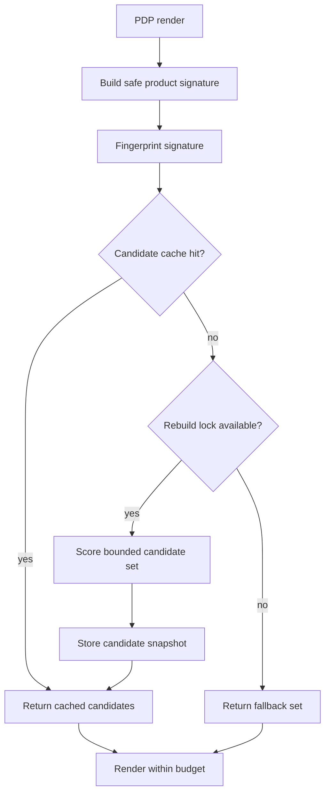

# Request Lifecycle

The recommendation block is part of the product detail page critical path. It should behave like a bounded read path, not a live catalog scan.

## Operating Notes

- The PDP should not scan the full catalog during normal render.
- Cache keys should include product-signature fingerprints.
- Invalidation should be planned around catalog changes, not only global cache clears.
- A safe fallback is better than delaying the PDP while recommendations rebuild.

